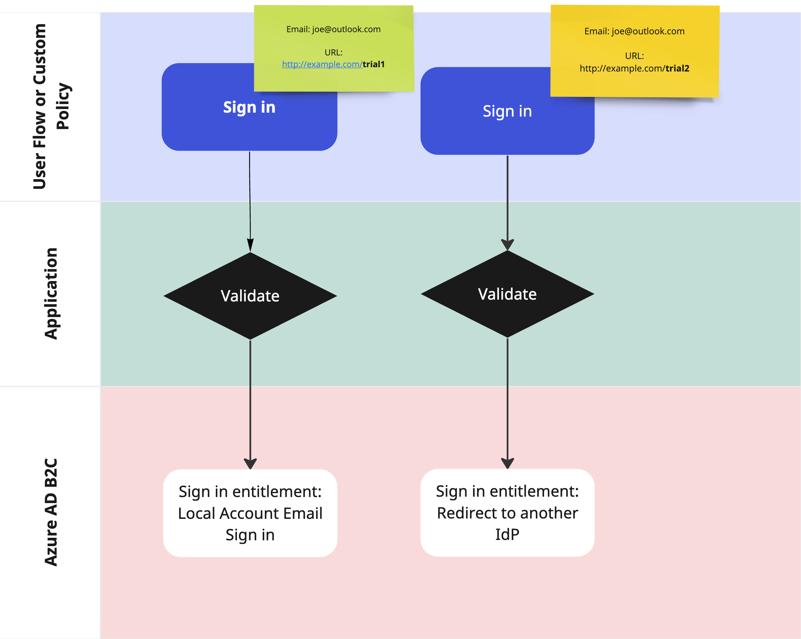
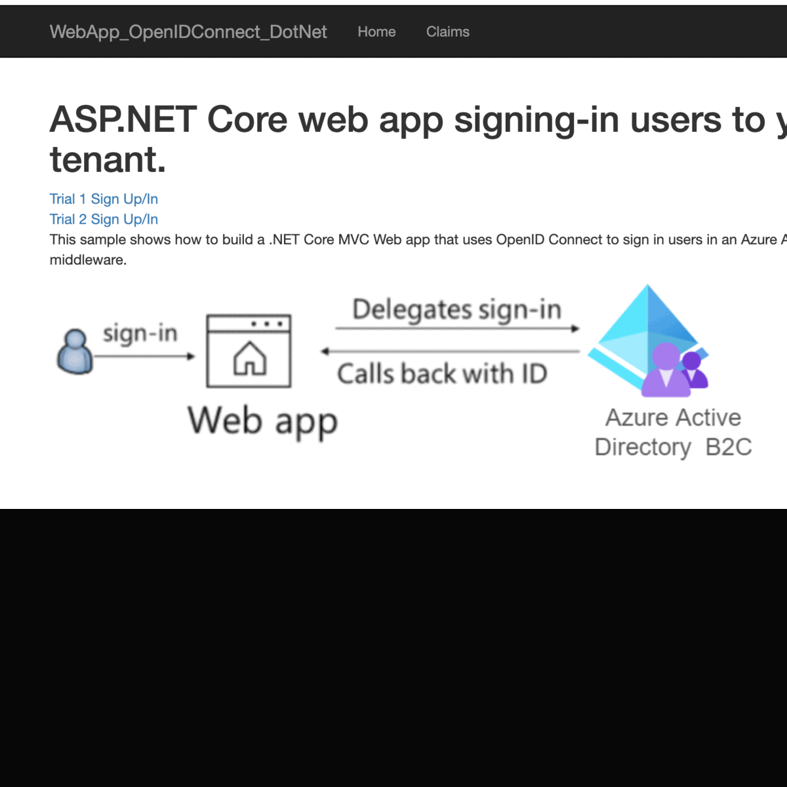

# Azure AD B2C: authenticate with the same email account against multiple identity providers
This project uses b2c custom policy to redirect users to different identity providers depending on the `domain_hint` value.

# :cloud: Scenario 
In a multitenant system, it's common to have multiple identity providers (IdP) to authenticate users.  For example, you may have a system that allows users to log in using their social media accounts e.g., Facebook, Google, Twitter, etc.  You may also have a system that allows users to log in using their corporate accounts e.g., Azure AD, Okta, etc.  In this case, you may want to allow users to log in using the same email address but redirect them to different IdP depending on the domain name of the email address.  For example, if the user's email address is `joe@outlook.com`, you may want to redirect them to the social media IdP.  If the user's email address is `joe@companyxyz.com`, you may want to redirect them to the corporate IdP.  This is [possible](https://github.com/azure-ad-b2c/samples/tree/master/policies/home-realm-discovery-page) in Azure AD B2C using domain hint.  

Another possible scenario is to use the same email address to authenticate against multiple identity providers. You can pass on `trial1` and `trial2` as domain hints as part of query parameters. 

See below illustration for more info. 

User flow:
1. On the sign-in page user provides the sign-in email address and clicks continue.
2. B2C checks the domain_hint provided as query parameter.
3. Based on the domain name, user continues with:
- Sign-in as a local account (user name and password).
- Redirect to a social account (Microsoft Account) to complete the sign-in.

# :rocket: Deploy the sample policy 

## Prerequisites

- You will require to [create an Azure AD B2C directory](https://docs.microsoft.com/azure/active-directory-b2c/tutorial-create-tenant).

- You can automate the prerequisites (where applicable) by using our using automated tool called [Deploy AAD B2C Custom Policies](https://aka.ms/iefsetup) if you already have an Azure AD B2C tenant.

# :computer: Deploy the sample web application 
This sample is based on [Azure AD B2C: ASP.NET Core Web App and Azure AD B2C](https://github.com/Azure-Samples/active-directory-aspnetcore-webapp-openidconnect-v2/blob/master/1-WebApp-OIDC/1-5-B2C/README.md). Modifications were made to add `domain_hint` as query parameter.  Two URLs were added to the homepage to allow users to sign in using the same email address but against different identity providers.

To deploy the application follow the instructions in [the sample](https://github.com/Azure-Samples/active-directory-aspnetcore-webapp-openidconnect-v2/blob/master/README.md#how-to-run-this-sample).

# :pencil: Further references 
[Configure custom domains in Azure AD B2C](https://learn.microsoft.com/en-us/azure/active-directory-b2c/custom-domain?pivots=b2c-custom-policy) 
[Customize the user interface with Azure Active Directory B2C](https://learn.microsoft.com/en-us/azure/active-directory-b2c/customize-ui?pivots=b2c-custom-policy) 
[Customize UI with HTML](https://learn.microsoft.com/en-us/azure/active-directory-b2c/customize-ui-with-html?pivots=b2c-custom-policy)
